<div align="center">

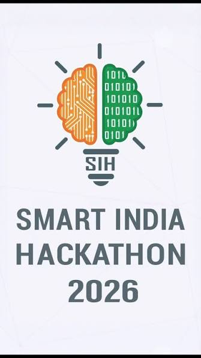
&nbsp;&nbsp;&nbsp;&nbsp;


# DRISHTI

### Drone-based Risk Intelligence & Surveillance Technology Initiative

> A modular Edge-AI environmental intelligence payload that retrofits
> compatible survey UAVs into automated disaster verification units.
> DRISHTI combines RGB, thermal, environmental, GPS/IMU sensing, onboard
> edge processing, local storage, and a live dashboard to detect,
> verify, localize, assess risk, and support faster response.

[](LICENSE)
[](https://www.espressif.com/en/products/socs/esp32-s3)
[](#9-edge-ai--dashboard)
[](#9-edge-ai--dashboard)
[](#2-executive-summary)
[](#2-executive-summary)
[](#2-executive-summary)

<br>

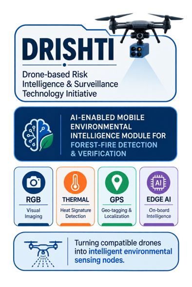

</div>

------------------------------------------------------------------------

## 📑 1. Table of Contents

-   [2. Executive Summary](#2-executive-summary)
-   [3. Problem Statement](#3-problem-statement)
-   [4. System Architecture](#4-system-architecture)
-   [5. Hardware Specifications](#5-hardware-specifications)
-   [6. Circuit & Prototype Explanation](#6-circuit--prototype-explanation)
-   [7. Hardware Integration & Pin Connections](#7-hardware-integration--pin-connections)
-   [8. Main System Modules](#8-main-system-modules)
-   [9. Edge-AI & Dashboard](#9-edge-ai--dashboard)
-   [10. Real-Life Applications](#10-real-life-applications)
-   [11. Future Upgrades](#11-future-upgrades)
-   [12. Project Status](#12-project-status)
-   [13. Conclusion](#13-conclusion)
-   [14. References](#14-references)

------------------------------------------------------------------------

## 2. Executive Summary

DRISHTI is a modular environmental intelligence payload designed to
mount on compatible existing survey UAVs.

The system is intended to close the gap between a broad environmental
alert and on-ground confirmation. Instead of requiring a new dedicated
disaster-monitoring UAV, DRISHTI uses a **retrofit-first architecture**
that adds sensing and intelligence capabilities to compatible
agency-owned drones.

The platform combines RGB imaging, thermal sensing, environmental
sensors, GPS/GNSS and IMU data with edge processing. Critical
information can be processed locally and stored during connectivity
loss, while available telemetry is transmitted to a centralized web
dashboard.

The complete operational pipeline is:

**Detect → Verify → Localize → Assess Risk → Act**

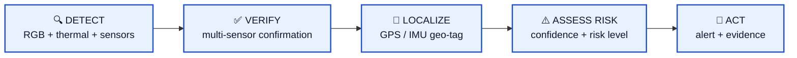
```mermaid
flowchart LR
    A["🔍 DETECT<br/>RGB + thermal + sensors"] --> B["✅ VERIFY<br/>multi-sensor confirmation"]
    B --> C["📍 LOCALIZE<br/>GPS / IMU geo-tag"]
    C --> D["⚠️ ASSESS RISK<br/>confidence + risk level"]
    D --> E["🚨 ACT<br/>alert + evidence"]
    classDef s fill:#e8f1ff,stroke:#1d4ed8,stroke-width:2px,color:#0f172a;
    class A,B,C,D,E s;
```

For the SIH 2026 project:

-   **Problem Statement ID:** 26178
-   **Problem Statement:** A Resilient AI-Powered Environmental
    monitoring network for early detection of environmental hazards.
-   **Theme:** Disaster Management
-   **Category:** Hardware
-   **Team ID:** 320
-   **Team Name:** Team Hexagon

### 🔑 What makes DRISHTI different

| 🛠️ Retrofit-first | 🧠 Edge-AI | 🔗 Multi-sensor truth | 📡 Offline-resilient |
|:--:|:--:|:--:|:--:|
| Plug-and-deploy payload for existing UAVs, no new drone procurement | Verification happens onboard, not after a cloud round-trip | RGB + thermal + environmental + GPS/IMU fused into one confidence score | Critical events buffered locally and sent when a link returns |

**OUR USP: RETROFIT, NOT REPLACE**

------------------------------------------------------------------------

## 3. Problem Statement

### ⚠️ The Challenge

Large forest and remote environmental regions are difficult to
continuously monitor using ground teams alone.

Satellite systems provide wide-area environmental monitoring, but the
resulting alert does not itself provide detailed, immediate, on-site
confirmation.

<div align="center">
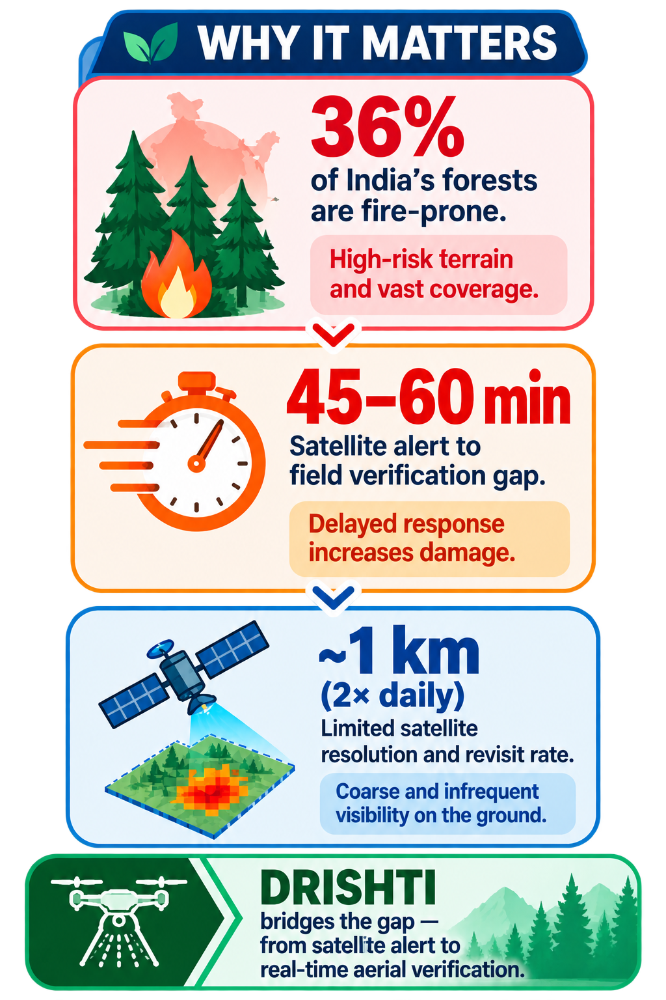
</div>

| 🌲 **36%** | ⏱️ **45–60 min** | 🛰️ **~1 km · 2× daily** |
|:--:|:--:|:--:|
| of India's forests are fire-prone | satellite alert to field-verification gap | limited satellite resolution and revisit rate |

The project identifies three major gaps:

-   **Coarse aerial visibility:** FSI MODIS/VIIRS alerts provide broad
    coverage but have approximately 1 km resolution and limited revisit
    frequency for a specific location.
-   **Verification gap:** A detected hotspot still needs confirmation
    before resources can be appropriately directed.
-   **Remote terrain:** Physically reaching difficult forest terrain for
    every potential event can delay assessment and consume manpower.

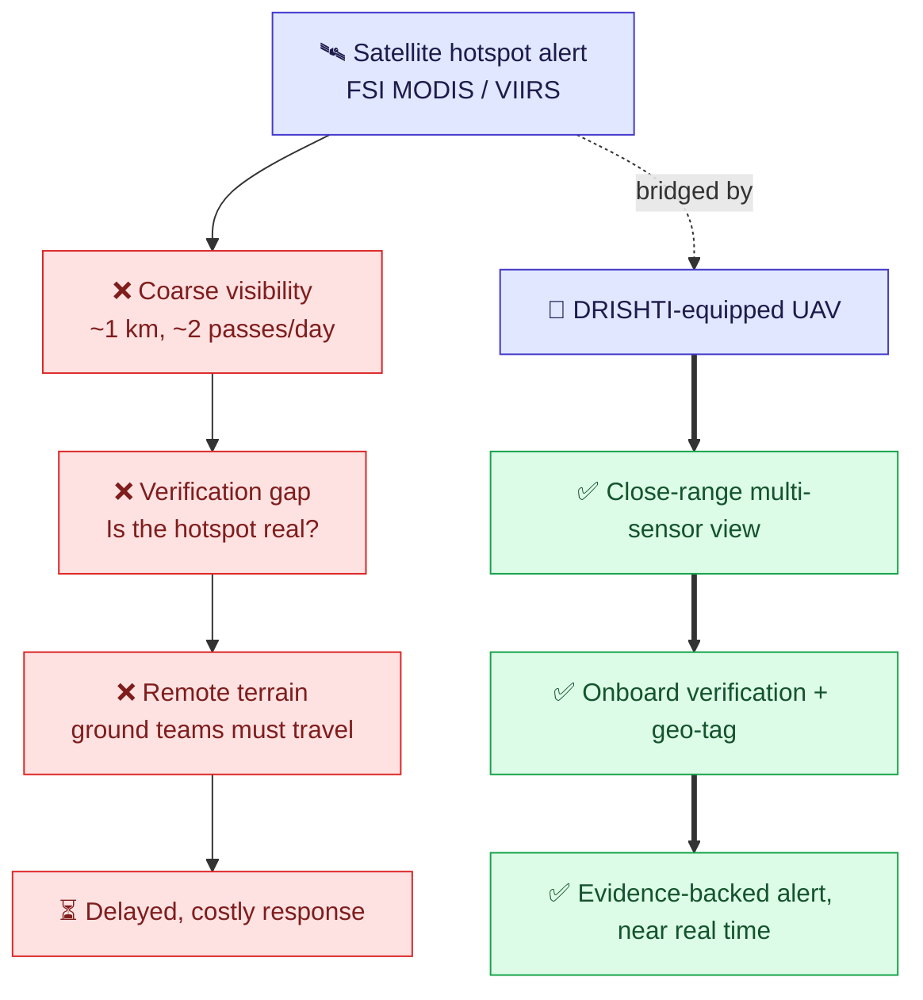
```mermaid
flowchart TB
    S["🛰️ Satellite hotspot alert<br/>FSI MODIS / VIIRS"] --> G1["❌ Coarse visibility<br/>~1 km, ~2 passes/day"]
    G1 --> G2["❌ Verification gap<br/>Is the hotspot real?"]
    G2 --> G3["❌ Remote terrain<br/>ground teams must travel"]
    G3 --> R["⏳ Delayed, costly response"]
    S -. "bridged by" .-> D["🚁 DRISHTI-equipped UAV"]
    D ==> F1["✅ Close-range multi-sensor view"]
    F1 ==> F2["✅ Onboard verification + geo-tag"]
    F2 ==> F3["✅ Evidence-backed alert, near real time"]
    classDef bad fill:#fee2e2,stroke:#dc2626,color:#7f1d1d;
    classDef good fill:#dcfce7,stroke:#16a34a,color:#14532d;
    classDef neutral fill:#e0e7ff,stroke:#4338ca,color:#1e1b4b;
    class G1,G2,G3,R bad;
    class F1,F2,F3 good;
    class S,D neutral;
```

| Capability | 🛰️ FSI satellite alerts | 🚁 DRISHTI payload |
|---|---|---|
| Role | Strategic wide-area tracking | Tactical on-site confirmation |
| Alert latency | ~45–60 min | Near real time (edge inference) |
| Revisit | ~2 passes/day | On demand, whenever the UAV flies |
| Resolution | ~1 km | Close-range RGB + thermal |
| Evidence | Hotspot flag | Geo-tagged imagery, sensor data, confidence, risk |
| Offline operation | n/a | Local buffering + store-and-forward |

### 💼 Operational Impact

Emergency and forest-management teams need information that is:

-   Rapid
-   Geo-tagged
-   Evidence-backed
-   Multisensor
-   Usable in difficult terrain
-   Available even when connectivity is unreliable

### 🎯 Project Objective

-   Retrofit compatible existing UAVs instead of requiring new UAV
    procurement.
-   Capture RGB, thermal and environmental information.
-   Process critical information near the source using edge computing.
-   Verify potential hazards using multiple sensing modalities.
-   Generate geo-tagged evidence, confidence and risk information.
-   Preserve critical event data during connectivity loss.
-   Provide live telemetry and visualization through a centralized
    dashboard.
-   Build an architecture that can scale from one UAV to fleets, regions
    and multiple hazard types.

------------------------------------------------------------------------

## 4. System Architecture

<p align="center">
  
  <br>
  <em>Figure: DRISHTI end-to-end architecture</em>
</p>

The project follows a sequential sensing-to-intelligence pipeline:

<p align="center">
  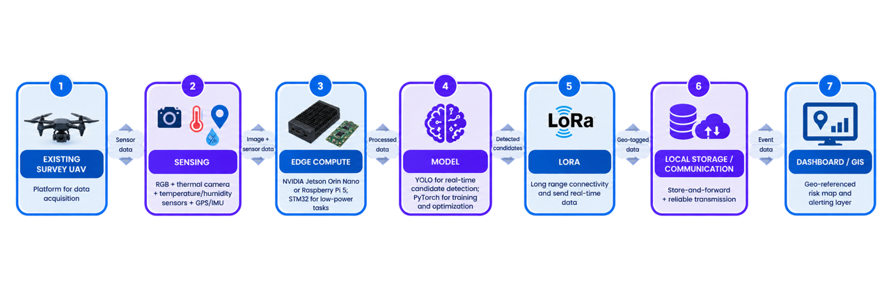
  <br>
  <em>Figure: Target 7-stage pipeline. The current prototype implements the sensing, storage/telemetry and dashboard stages on ESP32; Jetson-class compute, YOLO and LoRa are planned.</em>
</p>

-   **Step 1: Existing UAV / Retrofit Platform**\
    A compatible survey UAV acts as the aerial platform. DRISHTI is
    designed as a modular payload so the existing aircraft can be
    reused.

-   **Step 2: Multimodal Sensing**\
    The payload collects RGB imagery, thermal information,
    temperature/humidity, flame/environmental signals, GPS/GNSS and IMU
    data.

-   **Step 3: Edge Processing**\
    Sensor data and imagery are processed close to the source.
    Pre-processing includes image enhancement, sensor synchronization
    and event preparation.

-   **Step 4: AI/CV Verification**\
    The AI/CV layer identifies anomalies and combines information from
    multiple sensors to support event verification and confidence
    estimation.

-   **Step 5: Local Storage & Communication**\
    Critical data can be buffered locally. When connectivity is
    available, event telemetry can be transmitted through the
    communication layer.

-   **Step 6: Dashboard / GIS**\
    Geo-tagged events, telemetry, risk information and evidence are
    presented through the monitoring dashboard.

-   **Step 7: Actionable Intelligence**\
    The final output is intended to provide authorities with location,
    evidence, confidence and risk information for faster
    decision-making.

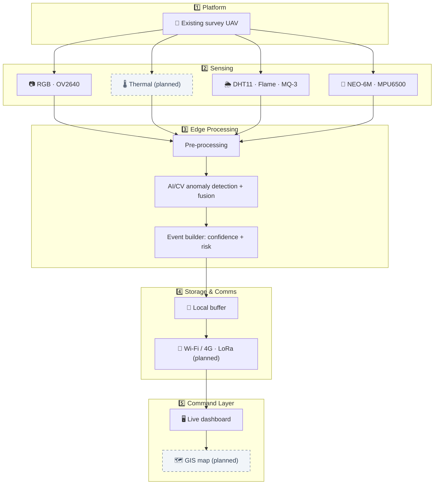
```mermaid
flowchart TB
    subgraph L1["1️⃣ Platform"]
        UAV["🚁 Existing survey UAV"]
    end
    subgraph L2["2️⃣ Sensing"]
        RGB["📷 RGB · OV2640"]
        THM["🌡️ Thermal (planned)"]
        ENV["🌦️ DHT11 · Flame · MQ-3"]
        NAV["📍 NEO-6M · MPU6500"]
    end
    subgraph L3["3️⃣ Edge Processing"]
        PRE["Pre-processing"]
        AI["AI/CV anomaly detection + fusion"]
        EVT["Event builder: confidence + risk"]
    end
    subgraph L4["4️⃣ Storage & Comms"]
        BUF["💾 Local buffer"]
        LINK["📶 Wi-Fi / 4G · LoRa (planned)"]
    end
    subgraph L5["5️⃣ Command Layer"]
        DASH["🖥️ Live dashboard"]
        GIS["🗺️ GIS map (planned)"]
    end
    UAV --> RGB & THM & ENV & NAV
    RGB & THM & ENV & NAV --> PRE --> AI --> EVT --> BUF --> LINK --> DASH --> GIS
    classDef plan stroke-dasharray: 5 5,fill:#f1f5f9,stroke:#64748b,color:#334155;
    class THM,GIS plan;
```

### Implementation Flow

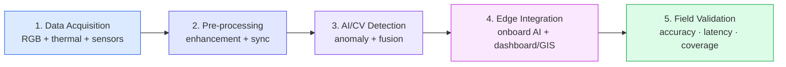
```mermaid
flowchart LR
    I1["1. Data Acquisition<br/>RGB + thermal + sensors"] --> I2["2. Pre-processing<br/>enhancement + sync"]
    I2 --> I3["3. AI/CV Detection<br/>anomaly + fusion"]
    I3 --> I4["4. Edge Integration<br/>onboard AI + dashboard/GIS"]
    I4 --> I5["5. Field Validation<br/>accuracy · latency · coverage"]
    style I1 fill:#dbeafe,stroke:#2563eb
    style I2 fill:#e0e7ff,stroke:#4f46e5
    style I3 fill:#ede9fe,stroke:#7c3aed
    style I4 fill:#fae8ff,stroke:#c026d3
    style I5 fill:#dcfce7,stroke:#16a34a
```

------------------------------------------------------------------------

## 5. Hardware Specifications

<p align="center">
  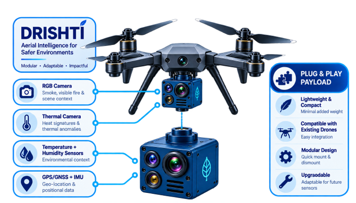
  <br>
  <em>Figure: Plug-and-play payload concept</em>
</p>

| Component | Part / Technology | Role in the Project |
|---|---|---|
| Edge Controller | ESP32 / ESP32-S3 | Sensor processing, communication and system control |
| Camera | ESP32-CAM + OV2640 | RGB visual evidence and image capture |
| Thermal | Thermal camera / future thermal module | Heat-signature and thermal anomaly detection |
| Environmental Sensor | DHT11 | Temperature and humidity |
| Flame Sensor | Flame detection module | Local flame indication |
| Gas Sensor | MQ-3 | Environmental / gas sensing for prototype verification |
| IMU | MPU6500 | Motion and orientation data |
| GPS | NEO-6M GNSS | Geo-tagging and localization |
| Display | OLED | Local system / risk status |
| Storage | Local storage / buffering | Event retention during connectivity loss |
| UAV Platform | Compatible survey UAV | Aerial sensing platform |

### 🧰 Current Prototype Sensors

The present prototype focuses on the embedded sensing and telemetry
foundation:

-   DHT11 for temperature and humidity
-   Flame sensor for flame indication
-   MQ-3 for gas/environmental sensing
-   MPU6500 for IMU data
-   NEO-6M for GPS
-   ESP32-CAM / OV2640 for RGB imagery
-   OLED for local status display

Thermal sensing and dedicated onboard AI hardware are part of the
planned system expansion.

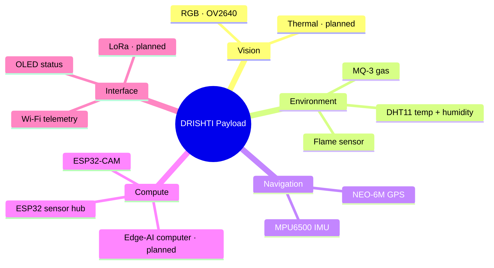
```mermaid
mindmap
  root((DRISHTI Payload))
    Vision
      RGB · OV2640
      Thermal · planned
    Environment
      DHT11 temp + humidity
      Flame sensor
      MQ-3 gas
    Navigation
      NEO-6M GPS
      MPU6500 IMU
    Compute
      ESP32 sensor hub
      ESP32-CAM
      Edge-AI computer · planned
    Interface
      OLED status
      Wi-Fi telemetry
      LoRa · planned
```


### 💰 Feasibility & Estimated Cost

<p align="center">
  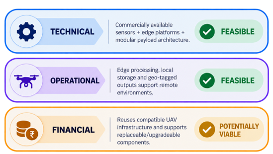
</p>

| Dimension | Verdict | Why |
|---|:--:|---|
| **Technical** | ✅ Feasible | Commercially available sensors + edge platforms → modular payload |
| **Operational** | ✅ Feasible | Edge processing, local storage and geo-tagged outputs support remote environments |
| **Financial** | 🟡 Potentially viable | Reuses compatible UAV infrastructure; replaceable / upgradable components |

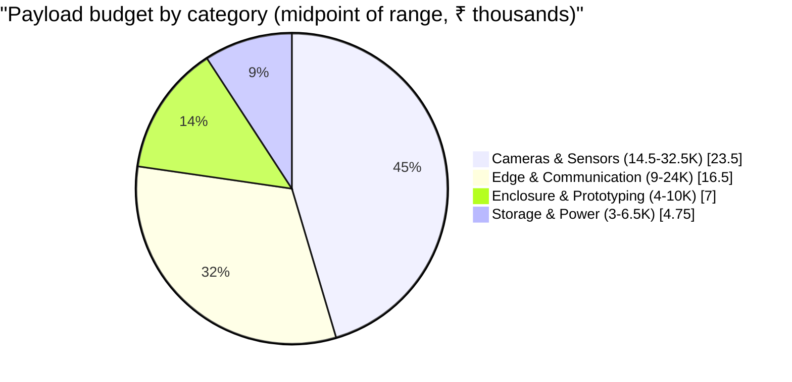
```mermaid
pie showData title "Payload budget by category (midpoint of range, ₹ thousands)"
    "Cameras & Sensors (14.5-32.5K)" : 23.5
    "Edge & Communication (9-24K)" : 16.5
    "Enclosure & Prototyping (4-10K)" : 7
    "Storage & Power (3-6.5K)" : 4.75
```

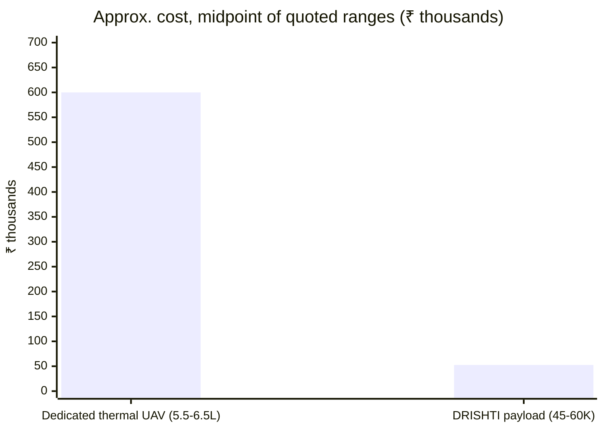
```mermaid
xychart-beta
    title "Approx. cost, midpoint of quoted ranges (₹ thousands)"
    x-axis ["Dedicated thermal UAV (5.5-6.5L)", "DRISHTI payload (45-60K)"]
    y-axis "₹ thousands" 0 --> 700
    bar [600, 52.5]
```

A dedicated thermal drone costs ₹5.5–6.5 lakh. The DRISHTI payload targets roughly ₹45K–60K and reuses UAVs agencies already own. Recurring costs are connectivity, maintenance and upkeep.

------------------------------------------------------------------------

## 6. Circuit & Prototype Explanation

The prototype is divided into sensing, processing, communication and
display modules.

``` text
Environmental Sensors
       │
       ├── DHT11
       ├── Flame Sensor
       └── MQ-3
       │
       ▼
     ESP32
       │
       ├── MPU6500
       ├── GPS
       ├── OLED
       └── Wi-Fi
       │
       ▼
   Telemetry Server
       │
       ▼
 DRISHTI Dashboard
```

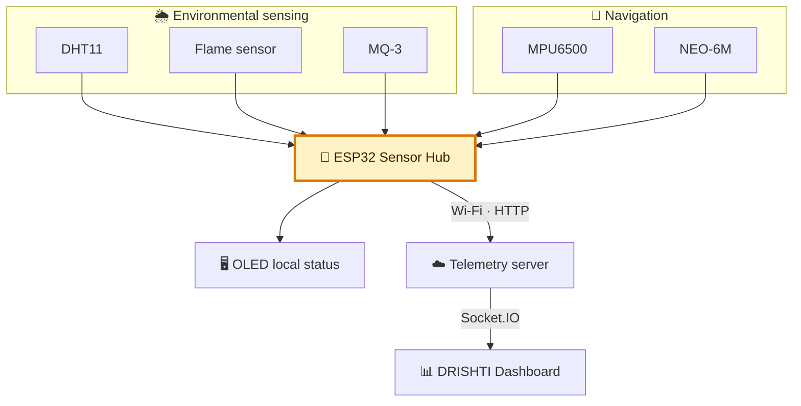
```mermaid
flowchart TB
    subgraph SENS["🌦️ Environmental sensing"]
        DHT["DHT11"]
        FL["Flame sensor"]
        MQ["MQ-3"]
    end
    subgraph NAVS["🧭 Navigation"]
        IMU["MPU6500"]
        GPS["NEO-6M"]
    end
    DHT & FL & MQ --> ESP["🧠 ESP32 Sensor Hub"]
    IMU & GPS --> ESP
    ESP --> OLED["🖥️ OLED local status"]
    ESP -- "Wi-Fi · HTTP" --> SRV["☁️ Telemetry server"]
    SRV -- "Socket.IO" --> DASH["📊 DRISHTI Dashboard"]
    classDef hub fill:#fef3c7,stroke:#d97706,stroke-width:3px,color:#451a03;
    class ESP hub;
```

<p align="center">
  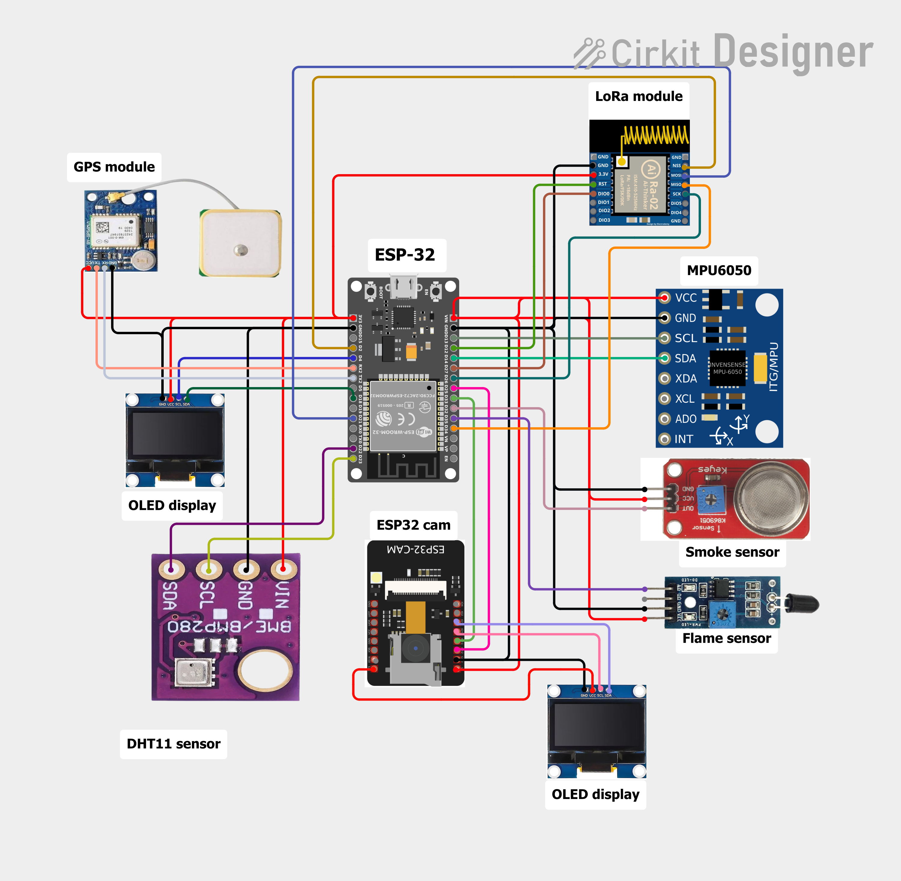
  <br>
  <em>Figure: Sensor hub circuit diagram</em>
</p>

<p align="center">
  
  <br>
  <em>Figure: Working prototype</em>
</p>

The camera subsystem operates as a complementary visual sensing unit:

``` text
OV2640
   ↓
ESP32-CAM
   ↓
Image Capture
   ↓
Camera Communication
   ↓
Dashboard / Evidence Layer
```


### Current Prototype Flow

1.  Sensors collect environmental and motion information.
2.  ESP32 reads and formats the sensor values.
3.  GPS provides geographic information.
4.  Camera captures RGB evidence.
5.  Telemetry is transmitted to the server when connectivity is
    available.
6.  The dashboard presents the incoming information in real time.
7.  Local displays provide immediate system status.

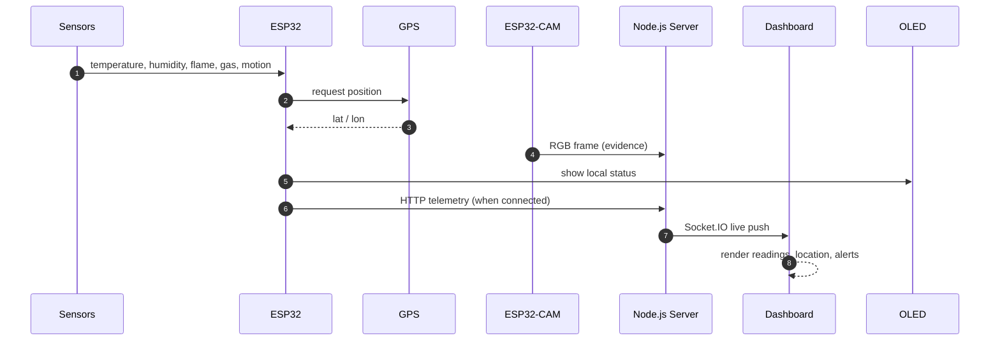
```mermaid
sequenceDiagram
    autonumber
    participant S as Sensors
    participant E as ESP32
    participant G as GPS
    participant C as ESP32-CAM
    participant N as Node.js Server
    participant D as Dashboard
    participant O as OLED
    S->>E: temperature, humidity, flame, gas, motion
    E->>G: request position
    G-->>E: lat / lon
    C->>N: RGB frame (evidence)
    E->>O: show local status
    E->>N: HTTP telemetry (when connected)
    N->>D: Socket.IO live push
    D-->>D: render readings, location, alerts
```

------------------------------------------------------------------------

## 7. Hardware Integration & Pin Connections

### 🔌 Sensor Hub Pin Configuration

| Device | ESP32 GPIO | Function |
|---|:--:|---|
| OLED SDA | `GPIO 18` | I²C data |
| OLED SCL | `GPIO 4` | I²C clock |
| MPU6500 SDA | `GPIO 14` | I²C data |
| MPU6500 SCL | `GPIO 13` | I²C clock |
| DHT11 | `GPIO 19` | Temperature / humidity |
| MQ-3 | `GPIO 35` | Analog gas/environmental sensing |
| Flame Sensor | `GPIO 34` | Flame input |
| GPS RX | `GPIO 16` | GPS serial receive |
| GPS TX | `GPIO 17` | GPS serial transmit |

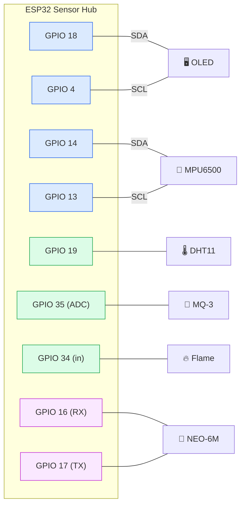
```mermaid
flowchart LR
    subgraph ESP["ESP32 Sensor Hub"]
        P18["GPIO 18"]
        P4["GPIO 4"]
        P14["GPIO 14"]
        P13["GPIO 13"]
        P19["GPIO 19"]
        P35["GPIO 35 (ADC)"]
        P34["GPIO 34 (in)"]
        P16["GPIO 16 (RX)"]
        P17["GPIO 17 (TX)"]
    end
    P18 -- "SDA" --- OLED["🖥️ OLED"]
    P4  -- "SCL" --- OLED
    P14 -- "SDA" --- IMU["🧭 MPU6500"]
    P13 -- "SCL" --- IMU
    P19 --- DHT["🌡️ DHT11"]
    P35 --- MQ["💨 MQ-3"]
    P34 --- FL["🔥 Flame"]
    P16 --- GPS["📍 NEO-6M"]
    P17 --- GPS
    classDef bus fill:#dbeafe,stroke:#2563eb;
    classDef io fill:#dcfce7,stroke:#16a34a;
    classDef ser fill:#fae8ff,stroke:#c026d3;
    class P18,P4,P14,P13 bus;
    class P19,P35,P34 io;
    class P16,P17 ser;
```

<sub>🔵 I²C buses · 🟢 digital / analog inputs · 🟣 UART</sub>

### 📷 ESP32-CAM Communication

The prototype camera subsystem uses an AI-Thinker / compatible ESP32-CAM
with OV2640.

The camera can provide RGB frames that complement environmental and
sensor telemetry.

------------------------------------------------------------------------

## 8. Main System Modules

### 🚁 1. Retrofit UAV Platform

The UAV is the carrier rather than the main intelligence layer.

The core design principle is:

**Existing compatible UAV + DRISHTI payload → Intelligent environmental
sensing node**

This allows the sensing system to be added to compatible existing UAV
infrastructure.

### 📷 2. RGB Imaging

The RGB camera provides visual context for an event.

It can help identify:

-   Smoke
-   Visible fire
-   Scene conditions
-   Vegetation
-   Infrastructure
-   Surrounding terrain

### 🌡️ 3. Thermal Sensing

Thermal sensing is intended to detect heat signatures that may not be
obvious from visible imagery.

This becomes particularly useful for:

-   Hotspots
-   Smouldering regions
-   Night-time monitoring
-   Areas partially obscured by smoke

### 🌦️ 4. Environmental Sensing

Environmental measurements provide additional context around a suspected
event.

Current prototype sensing includes:

-   Temperature
-   Humidity
-   Flame indication
-   Gas/environmental readings

### 📍 5. GPS / GNSS + IMU

GPS provides event coordinates while the IMU provides motion/orientation
information.

Together they support:

-   Geo-tagging
-   Location tracking
-   UAV state information
-   Event localization

### 🧠 6. Edge Intelligence

The edge layer is intended to perform processing close to the UAV rather
than sending every raw data stream to the cloud.

This reduces dependency on continuous connectivity and enables local
event processing.

### 💾 7. Local Storage & Communication

Critical information can be retained locally when communication is
unavailable.

The intended strategy is:

``` text
Sensor / Camera Data
        ↓
Local Processing
        ↓
Critical Event?
   ┌────┴────┐
  YES       NO
   ↓         ↓
Store      Process
   ↓
Connection Available?
   ├── YES → Transmit
   └── NO  → Retain
```

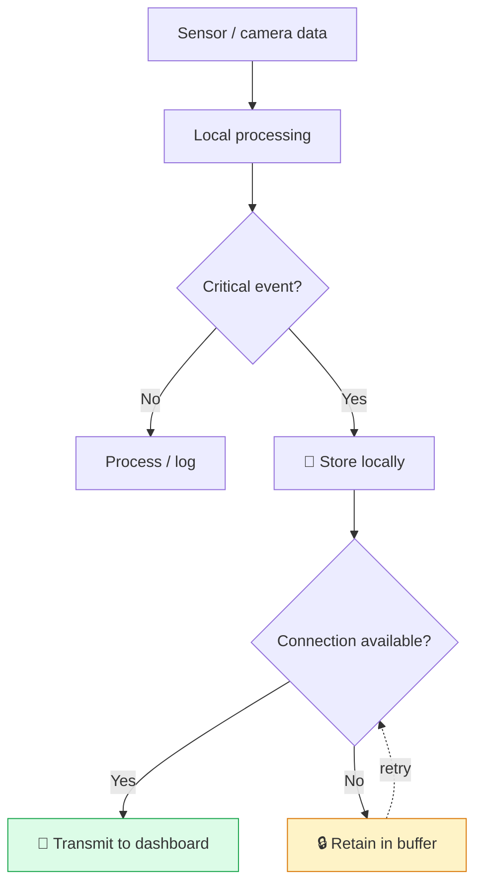
```mermaid
flowchart TD
    A["Sensor / camera data"] --> B["Local processing"]
    B --> C{"Critical event?"}
    C -- "No" --> D["Process / log"]
    C -- "Yes" --> E["💾 Store locally"]
    E --> F{"Connection available?"}
    F -- "Yes" --> G["📡 Transmit to dashboard"]
    F -- "No" --> H["🔒 Retain in buffer"]
    H -. "retry" .-> F
    classDef ok fill:#dcfce7,stroke:#16a34a;
    classDef warn fill:#fef3c7,stroke:#d97706;
    class G ok;
    class H warn;
```

### 🖥️ 8. Dashboard / GIS

The dashboard provides a centralized interface for viewing:

-   Live telemetry
-   Sensor readings
-   Camera information
-   GPS location
-   Risk information
-   Event status
-   Alerts

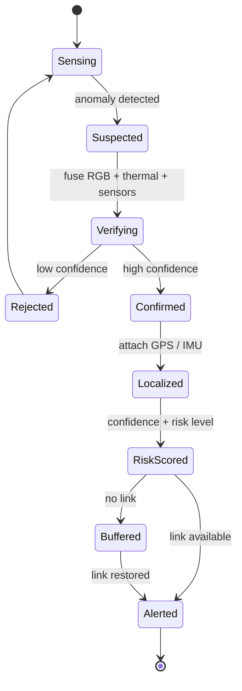
```mermaid
stateDiagram-v2
    [*] --> Sensing
    Sensing --> Suspected: anomaly detected
    Suspected --> Verifying: fuse RGB + thermal + sensors
    Verifying --> Rejected: low confidence
    Verifying --> Confirmed: high confidence
    Rejected --> Sensing
    Confirmed --> Localized: attach GPS / IMU
    Localized --> RiskScored: confidence + risk level
    RiskScored --> Buffered: no link
    RiskScored --> Alerted: link available
    Buffered --> Alerted: link restored
    Alerted --> [*]
```

<sub>Event lifecycle across all modules</sub>

------------------------------------------------------------------------

## 9. Edge-AI & Dashboard

### 🤖 Edge-AI Approach

The intended AI/CV pipeline is:

``` text
RGB + Thermal + Sensor Data
            ↓
       Pre-processing
            ↓
       Sensor Sync
            ↓
    Feature Extraction
            ↓
     Anomaly Detection
            ↓
      Sensor Fusion
            ↓
 Confidence / Risk Score
            ↓
   Geo-tagged Event
```

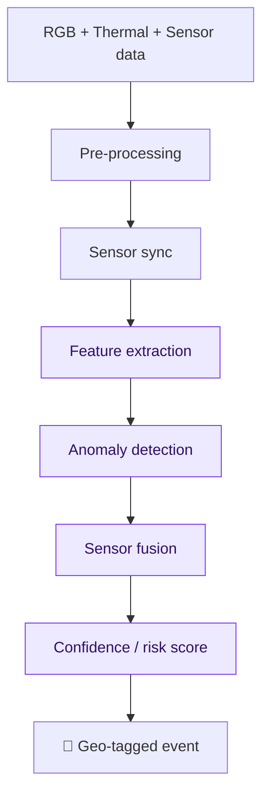
```mermaid
flowchart TD
    IN["RGB + Thermal + Sensor data"] --> P["Pre-processing"] --> SY["Sensor sync"] --> FE["Feature extraction"]
    FE --> AD["Anomaly detection"] --> SF["Sensor fusion"] --> CR["Confidence / risk score"] --> GE["📍 Geo-tagged event"]
    classDef ai fill:#ede9fe,stroke:#7c3aed,color:#2e1065;
    class FE,AD,SF,CR ai;
```

The key idea is not to depend on a single sensor.

For example:

``` text
Visual Anomaly
      +
Thermal Signature
      +
Temperature / Humidity
      +
Flame / Environmental Signal
      ↓
Event Verification
      ↓
Confidence + Risk
```

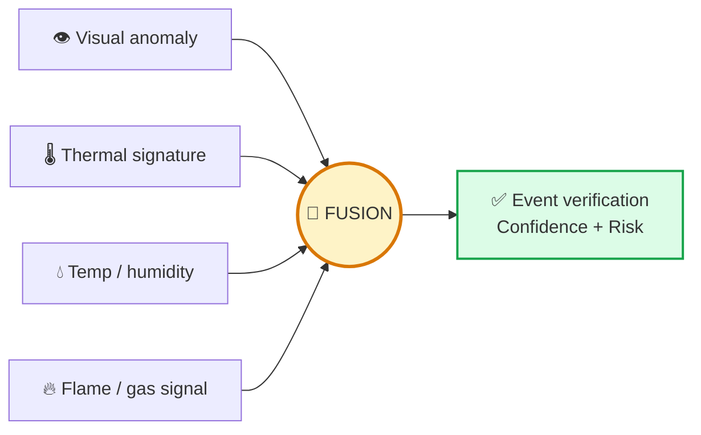
```mermaid
flowchart LR
    V["👁️ Visual anomaly"] --> F(("🧠 FUSION"))
    T["🌡️ Thermal signature"] --> F
    H["💧 Temp / humidity"] --> F
    G["🔥 Flame / gas signal"] --> F
    F --> OUT["✅ Event verification<br/>Confidence + Risk"]
    style F fill:#fef3c7,stroke:#d97706,stroke-width:3px
    style OUT fill:#dcfce7,stroke:#16a34a,stroke-width:2px
```

### 🛡️ Risks & Mitigation

| Risk | Impact | Mitigation |
|---|---|---|
| False positives | Unnecessary alerts | RGB + thermal fusion + temporal verification |
| Connectivity loss | Delayed transmission | Edge AI + local storage + store-and-forward |
| Dense canopy | Reduced visibility | Multiple observation angles + repeated surveys |
| Limited flight time | Reduced coverage | Payload optimization + efficient processing |
| AI generalization | Reliability of AI detection may decrease | Diverse datasets + field validation |

### 🌐 Live Dashboard

The software stack is designed around:

-   Node.js
-   Express.js
-   Socket.IO
-   HTML
-   CSS
-   JavaScript
-   REST-style telemetry endpoints
-   Real-time dashboard updates

<p align="center">
  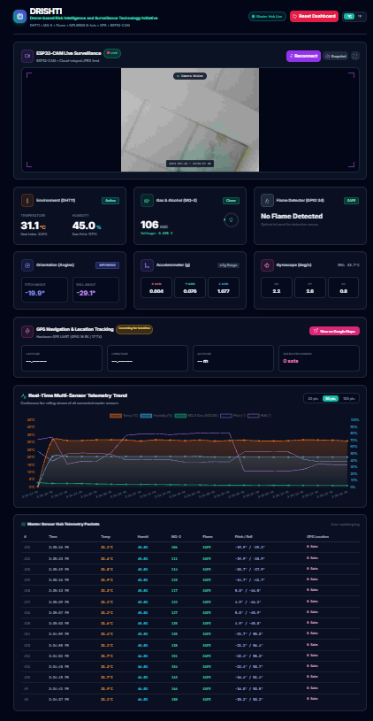
  <br>
  <em>Figure: DRISHTI live telemetry dashboard</em>
</p>

### Typical Data Flow

``` text
ESP32 Sensor Hub
       ↓
HTTP Telemetry
       ↓
Node.js Server
       ↓
Socket.IO
       ↓
Live Web Dashboard
```

### Deployment

The dashboard can be deployed as a Node.js web service on Render.

Typical commands:

``` bash
npm install
npm start
```

After deployment:

``` text
ESP32
  ↓
Internet
  ↓
Render Server
  ↓
Socket.IO
  ↓
DRISHTI Dashboard
```


```mermaid
flowchart LR
    ESP["ESP32"] --> NET["🌐 Internet"] --> R["☁️ Render server"] --> IO["Socket.IO"] --> UI["🖥️ DRISHTI Dashboard"]
    style R fill:#e0f2fe,stroke:#0284c7
```

------------------------------------------------------------------------

## 10. Real-Life Applications

<p align="center">
  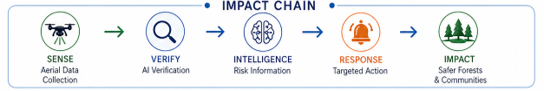
</p>


```mermaid
flowchart LR
    A["🚁 SENSE"] --> B["🔍 VERIFY"] --> C["🧠 INTELLIGENCE"] --> D["🎯 RESPONSE"] --> E["🌲 IMPACT"]
    style E fill:#dcfce7,stroke:#16a34a,stroke-width:2px
```

**See earlier · Verify faster · Respond smarter**

### 🔥 Forest & Wildlife Monitoring

-   Early verification of potential forest-fire events
-   Monitoring of difficult-to-access forest regions
-   Geo-tagged evidence for response teams
-   Repeated aerial surveys

### 🚑 Emergency Response

-   Rapid aerial assessment
-   Event verification before physical deployment
-   Risk-based prioritization
-   Situational awareness during response operations

### 🌊 Flood Monitoring

The same modular architecture can be adapted for:

-   Flooded regions
-   Water-level monitoring
-   Dam / embankment inspection
-   Post-flood assessment

### 🌱 Vegetation Monitoring

The payload can support:

-   Vegetation health monitoring
-   Environmental changes
-   Remote-area surveys
-   Agricultural/environmental inspection

### 🏭 Pollution & Infrastructure

Future sensing modules can support:

-   Air-quality monitoring
-   Industrial inspection
-   Infrastructure assessment
-   Environmental compliance monitoring

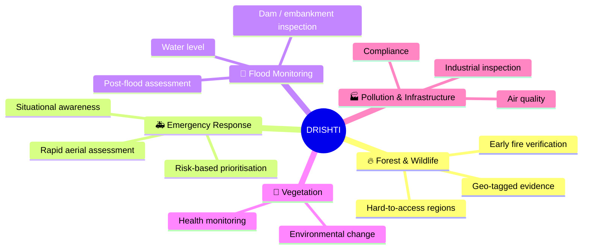
```mermaid
mindmap
  root((DRISHTI))
    🔥 Forest & Wildlife
      Early fire verification
      Hard-to-access regions
      Geo-tagged evidence
    🚑 Emergency Response
      Rapid aerial assessment
      Risk-based prioritisation
      Situational awareness
    🌊 Flood Monitoring
      Water level
      Dam / embankment inspection
      Post-flood assessment
    🌱 Vegetation
      Health monitoring
      Environmental change
    🏭 Pollution & Infrastructure
      Air quality
      Industrial inspection
      Compliance
```

### 👥 Who Benefits

| 🌲 Forest & Wildlife Authorities | 🚑 Emergency Response Teams | 🏘️ Local Communities |
|---|---|---|
| Faster identification and verification of potential fire events | Rapid aerial assessment before or during response | Earlier awareness of potential forest-fire threats |
| Geo-tagged risk information for targeted response | Reduced dependence on manual verification | Reduced risk to nearby settlements and livelihoods |
| Better monitoring of difficult-to-access forest regions | Incidents prioritised by confidence and risk | Improved environmental safety in vulnerable areas |

------------------------------------------------------------------------

## 11. Future Upgrades

-   **Thermal Camera Integration:** Add dedicated thermal imaging for
    heat-signature verification.
-   **Dedicated Edge-AI Computer:** Move heavier computer-vision
    inference to a more capable onboard compute platform.
-   **Multimodal Sensor Fusion:** Combine RGB, thermal and environmental
    features into a unified event-confidence model.
-   **Automated Risk Classification:** Generate structured risk levels
    from detected evidence.
-   **Offline-First Storage:** Expand event buffering and
    store-and-forward communication.
-   **GIS Integration:** Display geo-referenced incidents on a map-based
    command interface.
-   **Multi-UAV Coordination:** Support multiple DRISHTI-equipped UAVs
    from a centralized dashboard.
-   **LoRa / Long-Range Communication:** Add long-range telemetry for
    areas with limited cellular connectivity.
-   **Multi-Hazard Models:** Extend the same payload/software
    architecture to fire, flood, vegetation, pollution and
    infrastructure monitoring.
-   **Fleet Management:** Manage multiple payload-equipped agency UAVs
    from one operational interface.

### Scalability Roadmap

<p align="center">
  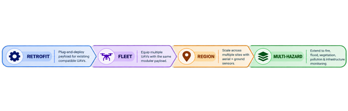
</p>

``` text
RETROFIT
   ↓
FLEET
   ↓
REGION
   ↓
MULTI-HAZARD
```


```mermaid
flowchart LR
    R1["⚙️ RETROFIT"] ==> R2["🚁 FLEET"] ==> R3["📍 REGION"] ==> R4["🧬 MULTI-HAZARD"]
    style R1 fill:#dbeafe,stroke:#2563eb,stroke-width:2px
    style R2 fill:#ede9fe,stroke:#7c3aed,stroke-width:2px
    style R3 fill:#ffedd5,stroke:#ea580c,stroke-width:2px
    style R4 fill:#dcfce7,stroke:#16a34a,stroke-width:2px
```

**RETROFIT:** Plug-and-deploy payload for compatible existing UAVs.

**FLEET:** Equip multiple agency-owned UAVs with the same modular
payload.

**REGION:** Scale across multiple sites with centralized aerial and
ground sensing.

**MULTI-HAZARD:** Reconfigure sensing and software for fire, flood,
vegetation, pollution and infrastructure monitoring.

------------------------------------------------------------------------

## 12. Project Status

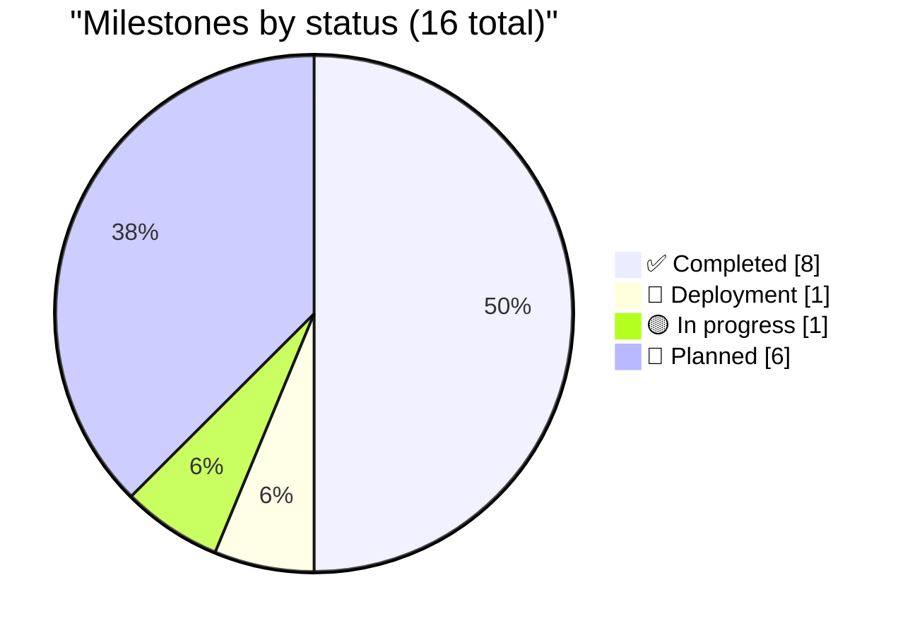
```mermaid
pie showData title "Milestones by status (16 total)"
    "✅ Completed" : 8
    "🔵 Deployment" : 1
    "🟡 In progress" : 1
    "🔵 Planned" : 6
```


```mermaid
flowchart LR
    subgraph DONE["✅ Completed"]
        d1["Architecture"]
        d2["Sensor hub"]
        d3["GPS"]
        d4["IMU"]
        d5["OLED"]
        d6["ESP32-CAM"]
        d7["Telemetry"]
        d8["Live dashboard"]
    end
    subgraph NOW["🟡 Now"]
        n1["Render deployment"]
        n2["Anomaly detection"]
    end
    subgraph NEXT["🔵 Planned"]
        p1["Multimodal fusion"]
        p2["Thermal"]
        p3["Edge compute"]
        p4["GIS map"]
        p5["Multi-UAV fleet"]
        p6["Multi-hazard"]
    end
    DONE --> NOW --> NEXT
    classDef done fill:#dcfce7,stroke:#16a34a;
    classDef now fill:#fef9c3,stroke:#ca8a04;
    classDef next fill:#dbeafe,stroke:#2563eb;
    class d1,d2,d3,d4,d5,d6,d7,d8 done;
    class n1,n2 now;
    class p1,p2,p3,p4,p5,p6 next;
```

| Category | Task / Milestone | Status | Details |
|---|---|:--:|---|
| **System** | DRISHTI Architecture | ✅ Completed | Modular retrofit-based environmental intelligence architecture defined |
| **Embedded** | Sensor Hub | ✅ Completed | ESP32-based environmental and motion sensing prototype |
| **Embedded** | GPS Integration | ✅ Completed | NEO-6M used for geo-tagging |
| **Embedded** | IMU Integration | ✅ Completed | MPU6500 used for motion/orientation data |
| **Embedded** | OLED Interface | ✅ Completed | Local status and telemetry display |
| **Camera** | ESP32-CAM + OV2640 | ✅ Completed | RGB image capture prototype |
| **Telemetry** | Sensor Data Transmission | ✅ Completed | Prototype telemetry sent to server |
| **Frontend** | Live Dashboard | ✅ Completed | Real-time telemetry visualization |
| **Deployment** | Cloud Dashboard | 🔵 Deployment | Node.js dashboard prepared for Render deployment |
| **AI/CV** | Anomaly Detection | 🟡 In Progress | AI/CV pipeline under development |
| **AI/CV** | Multimodal Sensor Fusion | 🔵 Planned | Combine visual, thermal and environmental evidence |
| **Hardware** | Thermal Integration | 🔵 Planned | Dedicated thermal sensing |
| **Edge AI** | Dedicated Edge Compute | 🔵 Planned | Onboard inference for heavier AI workloads |
| **GIS** | Geo-referenced Risk Map | 🔵 Planned | Map-based incident visualization |
| **Scalability** | Multi-UAV Fleet | 🔵 Planned | Centralized fleet monitoring |
| **Multi-Hazard** | Fire / Flood / Pollution / Infrastructure | 🔵 Planned | Expandable hazard-specific modules |

> **Legend:**\
> ✅ **Completed** --- Implemented and tested in the current prototype\
> 🟡 **In Progress** --- Active development\
> 🔵 **Planned** --- Staged for a future iteration

------------------------------------------------------------------------

## 13. Conclusion

DRISHTI establishes an end-to-end foundation for converting compatible
existing survey UAVs into intelligent environmental sensing platforms.

The central design principle is **RETROFIT, NOT REPLACE**.

The current prototype establishes the sensing, embedded processing,
GPS/IMU integration, camera subsystem and live telemetry/dashboard
foundation.

The planned Edge-AI layer extends this foundation by combining
multimodal observations to detect and verify environmental anomalies,
generate confidence and risk information, and provide geo-tagged
evidence.

The overall system is designed to progress from:

**Retrofit → Fleet → Region → Multi-Hazard**

The long-term objective is to provide authorities with a reusable aerial
intelligence layer that complements broad-area detection systems with
localized, evidence-backed verification.

<p align="center">
  
  <br>
  <em>Team Hexagon</em>
</p>

------------------------------------------------------------------------

## 14. References

### 📄 Project / SIH Information

-   **Smart India Hackathon 2026:** Problem Statement ID 26178
-   **Problem Statement:** A Resilient AI-Powered Environmental
    monitoring network for early detection of environmental hazards.
-   **Theme:** Disaster Management
-   **Category:** Hardware
-   **Team:** Team Hexagon
-   **Team ID:** 320

### 💻 Embedded & Hardware

-   **ESP32-S3:** [Espressif Systems
    ESP32-S3](https://www.espressif.com/en/products/socs/esp32-s3)
-   **ESP32 Arduino Core:** [Espressif
    Arduino-ESP32](https://github.com/espressif/arduino-esp32)
-   **ESP32-CAM:** AI-Thinker / compatible ESP32-CAM platform
-   **OV2640:** Camera sensor used with the ESP32-CAM
-   **MPU6500:** 6-axis motion sensor
-   **NEO-6M:** GNSS receiver
-   **DHT11:** Temperature and humidity sensor

### 🌐 Software

-   **Node.js:** [Node.js](https://nodejs.org/)
-   **Express.js:** [Express](https://expressjs.com/)
-   **Socket.IO:** [Socket.IO](https://socket.io/)
-   **Render:** [Render](https://render.com/)

### 🛰️ Environmental Monitoring

-   **Forest Survey of India:** [Forest Survey of
    India](https://fsi.nic.in/)
-   **FSI Forest Fire Monitoring:** [Near-real-time forest fire
    monitoring](https://fsiforestfire.gov.in/Home/NRTDetails)
-   **ISRO Forest & Environmental Applications:**
    [isro.gov.in](https://www.isro.gov.in/ForestandEnvironment.html)
-   **ISRO Earth Observation Research Areas:**
    [PDF](https://www.isro.gov.in/media_isro/pdf/programme/Research_Areas_in_Space_for_web2023.pdf)
-   **FSI Van Agni Geo-Portal:**
    [vanagniportal](https://www.vanagniportal.fsiforestfire.gov.in/)
-   **DGCA Drone Rules 2021:**
    [PDF](https://digitalsky.dgca.gov.in/assets/files/dronerules.pdf)

### 🔎 Existing Solutions Studied

| Solution | What it provides | Key gap |
|---|---|---|
| **OroraTech** · satellite monitoring | Thermal satellite data + AI wildfire detection | Wide-area only; limited close-range UAV |
| **Fixed AI + thermal cameras** · forest monitoring | Continuous fixed-site monitoring + real-time alerts | Fixed coverage; cannot move to new anomalies |
| **DJI thermal UAVs** · commercial | Thermal UAV solutions | Requires a specialized thermal UAV |
| **UAV + AI research systems** · academic | AI wildfire detection from UAV imagery | Detection shown; modular multi-sensor product architecture remains an opportunity |
| **Fixed thermal AI** · wildlife monitoring | Wildlife surveillance + fire-risk monitoring | Fixed observation infrastructure |
| **Thermal UAVs (Maharashtra)** · forest operations | Mobile thermal verification in dense forest / night | Specialized UAV; not a reusable intelligence payload |

------------------------------------------------------------------------

<p align="center">
  <strong>DRISHTI</strong><br>
  Detect • Verify • Localize • Assess Risk • Act
</p>

<p align="center">
  <strong>Team Hexagon • SIH 2026 • Team ID 320 • PS 26178</strong>
</p>
